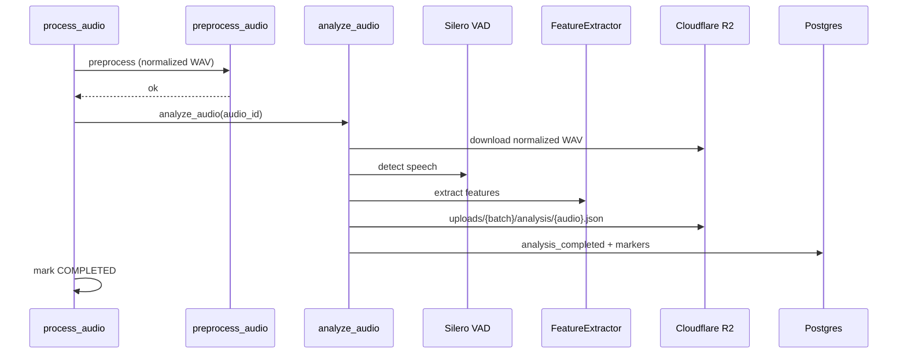

# Audio Analysis Foundation

Purpose: Produce reusable VAD + signal feature artifacts consumed by future AI engines.

Responsibilities: Voice activity detection, speech/silence segmentation, signal features, persistence.

Dependencies: Normalized audio from preprocessing, Silero VAD (`torch`), `librosa`, R2, `AudioRepository`.

Extension points: Technical / Acoustic / Speech Intelligence engines read `AnalysisArtifact` without re-running VAD.

---

## Pipeline



---

## Job orchestration

```text
process_batch
  └─ process_audio
       ├─ preprocess_audio
       ├─ analyze_audio
       └─ complete
```

No emotion / noise / prediction / confidence in this sprint.

---

## R2 layout

```text
uploads/{batch_id}/analysis/{audio_id}.json
```

---

## Database

| Column | Meaning |
|--------|---------|
| `analysis_completed` | Idempotency flag |
| `analysis_storage_key` | R2 JSON key |
| `analysis_version` | Artifact schema version (`1.0.0`) |
| `analysis_completed_at` | Timestamp |
| `analysis_json` | Cached artifact for API reads |

---

## HTTP API

- `GET /api/v1/audio/{id}/analysis`
- `GET /api/v1/audio/{id}/segments`
