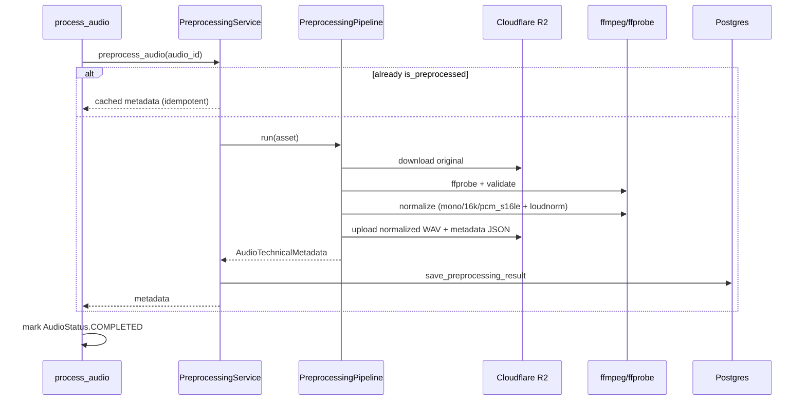

# Audio Preprocessing

Purpose: Standardize every uploaded audio file before AI inference.

Responsibilities: Download originals from R2, validate, extract metadata, normalize to
PCM WAV 16 kHz mono 16-bit with LUFS loudness, upload artifacts, persist metadata.

Dependencies: Cloudflare R2 (`StorageProvider`), ffmpeg/ffprobe, `AudioRepository`, Celery worker.

Extension points: Swap loudness strategy or add derivative formats without changing job orchestration.

---

## Pipeline



---

## Job orchestration integration

```text
process_batch
  └─ process_audio (per asset)
       └─ preprocess_audio
            └─ mark preprocessing complete (COMPLETED)
```

No emotion/noise/feature/prediction work in this sprint.

---

## R2 layout

```text
uploads/{batch_id}/
  original/{filename}
  normalized/{audio_id}.wav
  metadata/{audio_id}.json
```

---

## Database fields

| Column | Meaning |
|--------|---------|
| `is_preprocessed` | Idempotency flag |
| `normalized_storage_key` | R2 key for WAV |
| `preprocessed_at` | Completion timestamp |
| `metadata_json` | Full technical metadata (JSONB) |
| `duration` / `sample_rate` / `channels` | Denormalized originals |

---

## HTTP API

- `GET /api/v1/audio/{id}`
- `GET /api/v1/audio/{id}/metadata`
- `GET /api/v1/audio/{id}/download` — signed URL (normalized preferred)

---

## Configuration (`PREPROCESS_*`)

See `.env.example` for ffmpeg paths, LUFS target, silence trim, timeouts, and allowed codecs.
