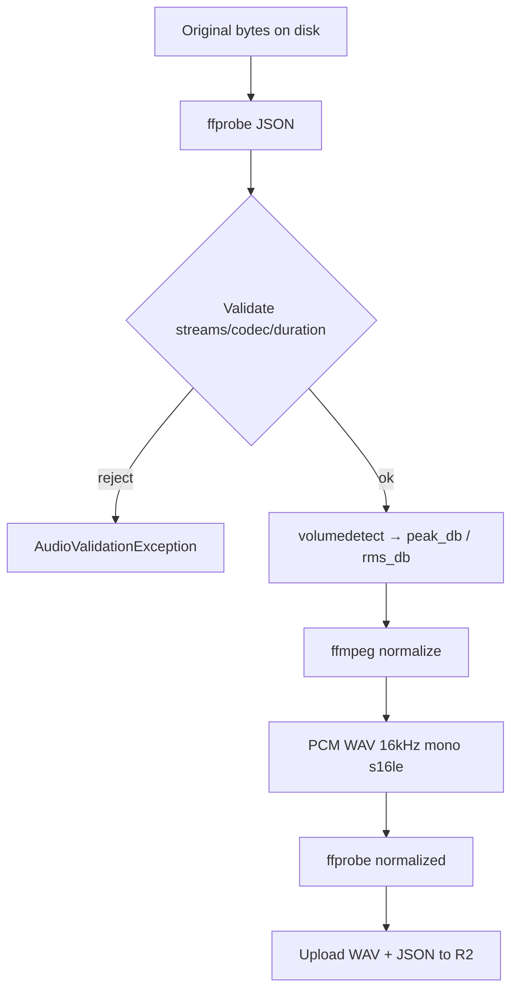

# FFmpeg Pipeline

Purpose: Document the ffmpeg/ffprobe commands used by the preprocessing engine.

---

## Tools

| Binary | Role |
|--------|------|
| `ffprobe` | Stream/format inspection (JSON) |
| `ffmpeg` | Level measurement, conversion, LUFS, silence trim |

Installed in the **worker** image (`docker/Dockerfile.worker`).

---

## Sequence



---

## Normalize filter graph

Configurable silence trim (optional) + EBU-style loudnorm:

```text
silenceremove=start_periods=1:start_duration=...:start_threshold=...dB:
              stop_periods=1:stop_duration=...:stop_threshold=...dB,
loudnorm=I={target_lufs}:TP={true_peak}:LRA={loudness_range}
```

Then:

```text
-ac 1 -ar 16000 -c:a pcm_s16le -f wav
```

---

## Timeouts

- `PREPROCESS_FFPROBE_TIMEOUT_SECONDS` (default 30)
- `PREPROCESS_FFMPEG_TIMEOUT_SECONDS` (default 120)

Timeouts raise `PreprocessingTimeoutException` → Celery `TimeoutError` for retry.

---

## Failure mapping

| Failure | Exception | Worker behavior |
|---------|-----------|-----------------|
| Bad/corrupt/unsupported | `AudioValidationException` | Mark asset FAILED (no infinite retry) |
| ffprobe/ffmpeg binary or encode | `FFprobeException` / `FFmpegException` | Mark FAILED |
| R2 download/upload | `AudioDownloadException` / `AudioUploadException` | Mark FAILED |
| Timeout | `PreprocessingTimeoutException` | Celery retry (max 3) |
