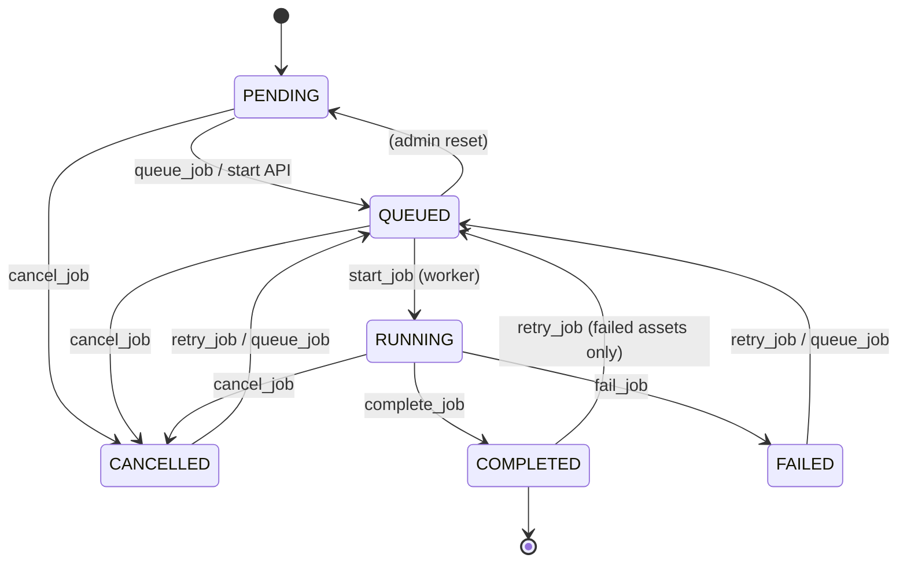
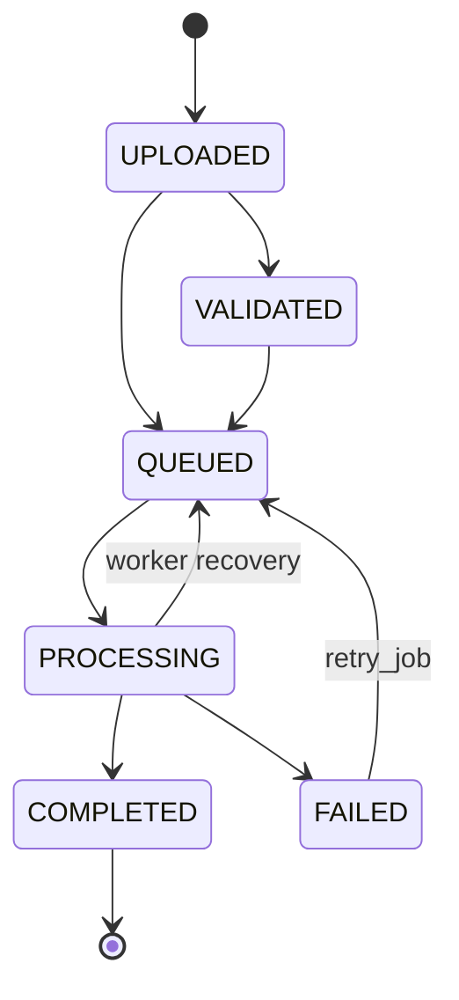

# Job Lifecycle

Purpose: Document asynchronous job state transitions for the orchestration engine.

Responsibilities covered: `JobService` transitions, Celery queueing, progress fields.

Dependencies: `JobStatus` enum, `jobs.state_machine`, Celery `process_batch`.

Extension points: Stage-level statuses (preprocess / infer / aggregate) without changing the outer job FSM.

---

## Job status machine

Illegal transitions raise `InvariantViolationException` / `JobStateException`.

---

## Audio status machine (orchestration)

`PROCESSED` remains a legacy synonym of successful analysis; orchestration marks assets `COMPLETED`.

---

## Service API

| Method | Behavior |
|--------|----------|
| `create_job` | Create PENDING job for a batch (idempotent if exists) |
| `queue_job` | PENDING/FAILED/CANCELLED/COMPLETED → QUEUED; enqueue Celery |
| `start_job` | QUEUED → RUNNING; set `started_at` |
| `complete_job` | RUNNING → COMPLETED |
| `fail_job` | RUNNING → FAILED |
| `cancel_job` | → CANCELLED (if allowed) |
| `retry_job` | Failed assets only; max 3; exponential backoff |
| `update_progress` | Persist counters + Redis cache |

Progress formula (domain rule 5):

`progress_percentage = round(processed_files / total_files * 100)`

Failed assets are counted separately and **do not** block job completion (rule 6).

---

## Retry policy

- Maximum retries: `JOB_MAX_RETRIES` (default 3)
- Backoff: `base * 2^(retry_count-1)` seconds (`JOB_RETRY_BACKOFF_BASE_SECONDS`)
- Only `FAILED` audio assets are re-queued
- Completed assets are never duplicated (`process_audio` is idempotent)

---

## HTTP endpoints

- `POST /api/v1/jobs/{job_id}/start`
- `POST /api/v1/jobs/{job_id}/retry`
- `POST /api/v1/jobs/{job_id}/cancel`
- `GET /api/v1/jobs/{job_id}`
- `GET /api/v1/jobs/{job_id}/progress`
- `GET /api/v1/jobs`
