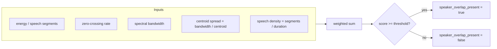

# Speaker Overlap Detection

Sprint 6 ships a signal-based heuristic detector behind the `OverlapDetector`
interface. The interface is the contract; implementations are swappable without
changing `TechnicalService`, `TechnicalAnalyzer`, or the pipeline.

## Interface

```python
class OverlapDetector(Protocol):
    def detect(
        self,
        features: SignalFeatures,
        vad: VADResult,
    ) -> tuple[bool, float, dict[str, float]]:
        """Return (present, score, details)."""
```

Implementations:

| Class | Status |
| --- | --- |
| `SignalBasedOverlapDetector` | Active (Sprint 6) |
| `PyannoteOverlapDetector` | Placeholder — raises until enabled |
| `NeuralOverlapDetector` | Future |

Swapping happens only in `ai/technical/factory.py::build_overlap_detector`.

## Signal-based heuristic



```
score = w_density     * density_score
      + w_zcr         * norm(zcr,            zcr_min,            zcr_max)
      + w_bandwidth   * norm(bandwidth,      bandwidth_min_hz,   bandwidth_max_hz)
      + w_spread      * norm(bandwidth/centroid, spread_min,     spread_max)

density_score = clamp01((segments / duration) / overlap_density_full_at)

speaker_overlap_present = score >= overlap_threshold  (default 0.6)
```

Rationale: overlapping speakers raise spectral width and zero-crossing rate and
produce dense, short VAD segments from rapid turn-taking.

## Configuration

All weights, normalization anchors, and the decision threshold are
`TECHNICAL_OVERLAP_*` settings. See `.env.example`.

## Future pyannote integration

`PyannoteOverlapDetector` will:

1. Run pyannote overlapped-speech-detection on the normalized waveform
   (16 kHz mono WAV produced in Sprint 4 — no re-normalization needed).
2. Convert frame-level overlap posteriors to a single `score` (e.g. fraction of
   speech frames with posterior ≥ 0.5) and `present = score >= threshold`.
3. Keep the same return contract, so persistence, API, and tests stay unchanged.

Integration notes:

- Model loading must be lazy and cached per worker process (see how
  `SileroVAD` is built in `audio/analysis/factory.py`).
- Hugging Face credentials belong in `Settings`, never `os.getenv` in logic.
- GPU/CPU selection and inference timeout should be new `TechnicalSettings`
  fields when the detector is enabled.
- The detector must remain callable with the same
  `(features, vad)` signature; waveform access can be added through the
  `StorageProvider` inside the detector if needed.
