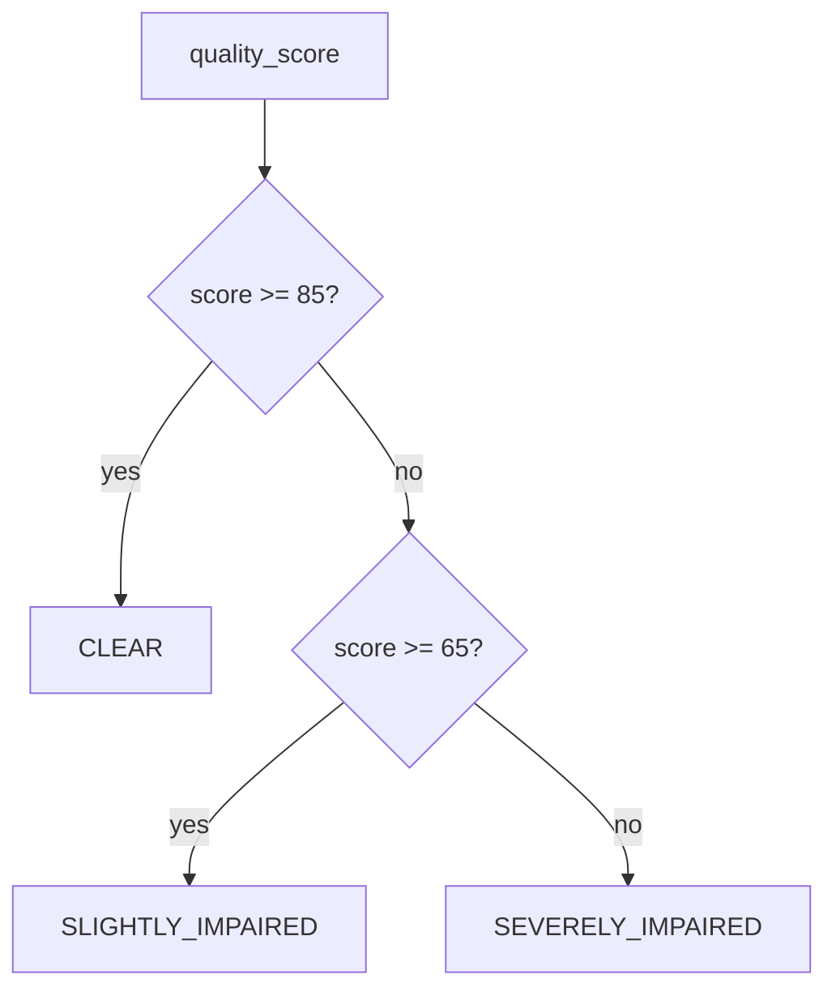

# Audio Quality Scoring

Deterministic, model-free scoring used by `AudioQualityAnalyzer`.
No AI model is involved; every weight and threshold is configurable via
`TechnicalSettings` (`TECHNICAL_*`).

## Inputs (from Sprint 5 artifacts)

| Feature | Source |
| --- | --- |
| `snr_estimate` (dB) | `SignalFeatures.snr_estimate` |
| `dynamic_range` (dB) | `SignalFeatures.dynamic_range` |
| `peak_amplitude` | `SignalFeatures.peak_amplitude` (clipping proxy) |
| `rms_energy` | `SignalFeatures.rms_energy` |
| `speech_ratio` / silence ratio | `VADResult.speech_ratio` |
| Missing audio | `snr_estimate is None` |

## Scoring formula

```
quality_score = 100 - min(100, total_penalty)

total_penalty = snr_penalty
              + clipping_penalty
              + dynamic_range_penalty
              + silence_penalty
              + speech_presence_penalty
```

Each penalty is a linear ramp between configurable anchors, capped by its weight:

| Penalty | Weight (default) | Ramp |
| --- | --- | --- |
| `snr_penalty` | 30 | 0 at `snr_good_db` (25) → full at `snr_ok_db` (12); missing SNR adds flat `missing_snr_penalty` (12) |
| `clipping_penalty` | 25 | Peak ≥ 0.99 scaled by dynamic-range compression |
| `dynamic_range_penalty` | 20 | 0 at `dynamic_range_good_db` (18) → full at `dynamic_range_bad_db` (6) |
| `silence_penalty` | 15 | 0 at `silence_ratio_warn` (0.35) → full at `silence_ratio_bad` (0.75) |
| `speech_presence_penalty` | 10 | 0 at `speech_ratio_good` (0.6) → full at `speech_ratio_bad` (0.15) |

## Classification bands



- `CLEAR` — `quality_score >= TECHNICAL_CLEAR_THRESHOLD` (85)
- `SLIGHTLY_IMPAIRED` — `>= TECHNICAL_SLIGHTLY_IMPAIRED_THRESHOLD` (65)
- `SEVERELY_IMPAIRED` — otherwise

## Transparency

Every score ships with a `quality_breakdown` payload containing each penalty
component and `total_penalty`, so downstream consumers (QA analytics, coaching)
can explain the grade without re-running the engine.

## Extension points

- Weights and thresholds are settings-driven; tuning never requires code changes.
- A future learned calibrator can replace `_score` behind the same
  `AudioQualityAnalyzer` interface without touching the pipeline.
