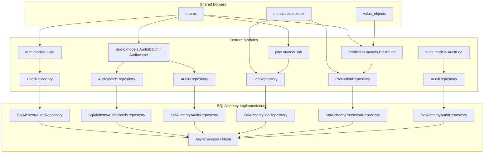

# Repository Dependency Diagram

## Ownership rules

| Aggregate / Entity | Repository | Notes |
| --- | --- | --- |
| User | `UserRepository` | create, find_by_id, find_by_email, update |
| AudioBatch | `AudioBatchRepository` | create, find_by_id, update_status, list_by_uploader |
| AudioAsset | `AudioRepository` | create, find, update_status, find_by_batch |
| Job | `JobRepository` | create, find, find_active, update_status |
| Prediction | `PredictionRepository` | save (immutable after), find |
| AuditLog | `AuditRepository` | append, find |

Repositories contain persistence only. Domain invariants live in value objects, entity methods, and repository guards (prediction immutability).
