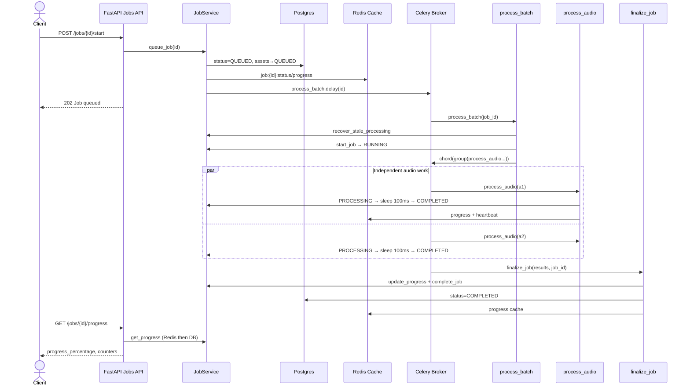
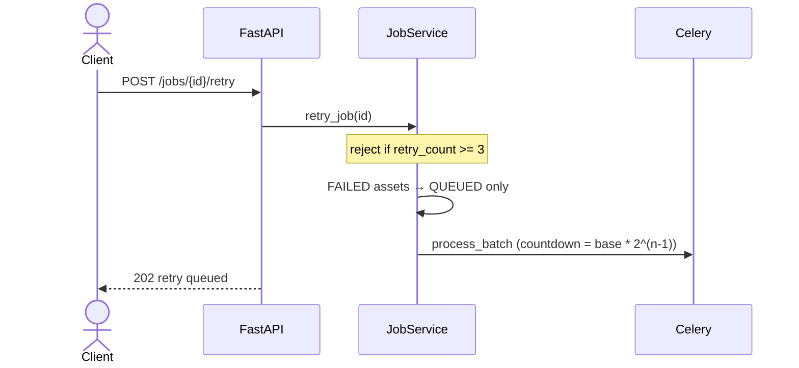
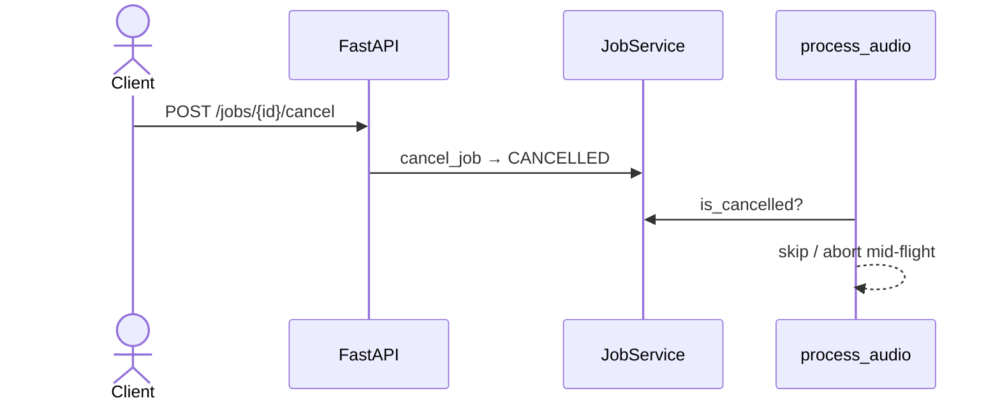

# Sequence: Job Processing

Purpose: End-to-end orchestration sequence for Sprint 3 (no AI).

---

## Happy path

```mermaid
sequenceDiagram
    actor Client
    participant API as FastAPI Jobs API
    participant Svc as JobService
    participant DB as Postgres
    participant Redis as Redis Cache
    participant Broker as Celery Broker
    participant Batch as process_batch
    participant Audio as process_audio
    participant Final as finalize_job

    Client->>API: POST /jobs/{id}/start
    API->>Svc: queue_job(id)
    Svc->>DB: status=QUEUED, assets→QUEUED
    Svc->>Redis: job:{id}:status/progress
    Svc->>Broker: process_batch.delay(id)
    API-->>Client: 202 Job queued

    Broker->>Batch: process_batch(job_id)
    Batch->>Svc: recover_stale_processing
    Batch->>Svc: start_job → RUNNING
    Batch->>Broker: chord(group(process_audio...))

    par Independent audio work
        Broker->>Audio: process_audio(a1)
        Audio->>Svc: PROCESSING → sleep 100ms → COMPLETED
        Audio->>Redis: progress + heartbeat
    and
        Broker->>Audio: process_audio(a2)
        Audio->>Svc: PROCESSING → sleep 100ms → COMPLETED
    end

    Broker->>Final: finalize_job(results, job_id)
    Final->>Svc: update_progress + complete_job
    Final->>DB: status=COMPLETED
    Final->>Redis: progress cache

    Client->>API: GET /jobs/{id}/progress
    API->>Svc: get_progress (Redis then DB)
    API-->>Client: progress_percentage, counters
```

---

## Retry path

```mermaid
sequenceDiagram
    actor Client
    participant API as FastAPI
    participant Svc as JobService
    participant Broker as Celery

    Client->>API: POST /jobs/{id}/retry
    API->>Svc: retry_job(id)
    Note over Svc: reject if retry_count >= 3
    Svc->>Svc: FAILED assets → QUEUED only
    Svc->>Broker: process_batch (countdown = base * 2^(n-1))
    API-->>Client: 202 retry queued
```

---

## Cancellation

```mermaid
sequenceDiagram
    actor Client
    participant API as FastAPI
    participant Svc as JobService
    participant Audio as process_audio

    Client->>API: POST /jobs/{id}/cancel
    API->>Svc: cancel_job → CANCELLED
    Audio->>Svc: is_cancelled?
    Audio-->>Audio: skip / abort mid-flight
```
