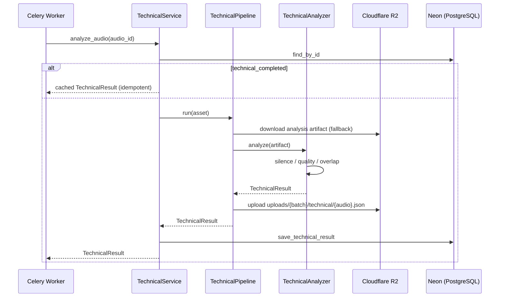
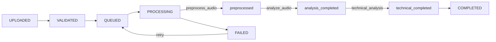

# Technical Intelligence Engine

Sprint 6 module. Consumes Sprint 5 analysis artifacts and produces the technical
assessment outputs: `audio_quality`, `speaker_overlap_present`, `long_silence_present`.

## Purpose

- Deterministic, model-free technical assessment of call recordings.
- No emotion detection, no background-noise classification, no prediction aggregation.

## Responsibilities

| Component | Responsibility |
| --- | --- |
| `ai/technical/silence.py` | `LongSilenceDetector` — rule-based long-silence flags from VAD output |
| `ai/technical/quality.py` | `AudioQualityAnalyzer` — deterministic quality scoring (see QUALITY_SCORING.md) |
| `ai/technical/overlap.py` | `OverlapDetector` interface + `SignalBasedOverlapDetector` |
| `ai/technical/analyzer.py` | `TechnicalAnalyzer` — composes the three detectors |
| `ai/technical/pipeline.py` | Loads analysis artifacts, runs analyzer, uploads JSON to R2 |
| `ai/technical/service.py` | `TechnicalService` — idempotent orchestration + DB persistence |
| `ai/technical/factory.py` | Constructor used by Celery tasks and tests |

## Sequence



## State flow



## Pipeline position

```
process_audio
  → preprocess_audio
  → analyze_audio
  → technical_analysis
  → persist_technical_results
```

## Outputs

```json
{
  "audio_id": "...",
  "batch_id": "...",
  "version": "1.0.0",
  "audio_quality": "CLEAR",
  "speaker_overlap_present": false,
  "long_silence_present": false,
  "quality_score": 96.2,
  "quality_breakdown": { "snr_penalty": 0.0, "...": "..." },
  "overlap_score": 0.12,
  "overlap_details": {},
  "silence_details": {}
}
```

## Storage

- R2: `uploads/{batch_id}/technical/{audio_id}.json`
- DB columns on `audio_assets`: `technical_completed`, `technical_version`,
  `technical_completed_at`, `technical_json` (JSONB cache).

## API

`GET /api/v1/audio/{audio_id}/technical`

```json
{
  "success": true,
  "message": "Audio technical results retrieved",
  "data": {
    "audio_id": "...",
    "audio_quality": "CLEAR",
    "speaker_overlap_present": false,
    "long_silence_present": false,
    "technical_version": "1.0.0",
    "technical_completed": true
  }
}
```

## Configuration

All thresholds live in `TechnicalSettings` (`TECHNICAL_*` env prefix). No threshold
is hardcoded in business logic.

## Error handling

| Failure | Exception | Worker behavior |
| --- | --- | --- |
| Analysis artifacts missing/unreadable | `TechnicalArtifactMissingException` (412) | Re-raised as timeout → Celery retry |
| Quality scoring failure | `QualityScoringException` (502) | Asset marked FAILED |
| Overlap detection failure | `OverlapDetectionException` (502) | Asset marked FAILED |
| Technical results requested but absent | `TechnicalNotFoundException` (404) | API only |

## Idempotency

`TechnicalService.analyze_audio` short-circuits when `technical_completed` and
`technical_json` are set. Retrying a job never re-uploads or re-persists technical
results for assets that already completed this stage.

## Explicitly out of scope (Sprint 6)

Emotion detection, noise classification, confidence scoring, prediction
aggregation, dashboard, authentication changes.
