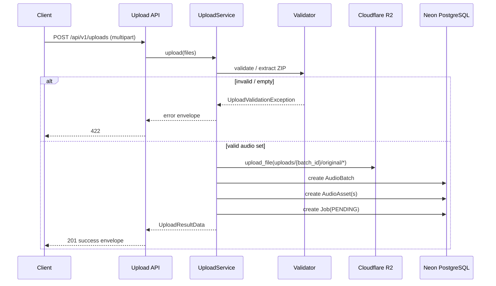

# Upload Flow

## Overview

Sprint 2 delivers the upload and storage pipeline:

1. Accept ZIP and/or individual audio files (`.wav`, `.mp3`, `.ogg`)
2. Validate MIME type, extension, size, duplicates, and ZIP integrity
3. Store originals in Cloudflare R2
4. Persist `AudioBatch`, `AudioAsset`, and `Job(status=PENDING)`

No AI, Celery processing, or authentication is performed.

## Endpoint

`POST /api/v1/uploads`

Multipart form field: `files` (one or more)

### Success response

```json
{
  "success": true,
  "message": "Upload accepted",
  "data": {
    "batch_id": "...",
    "job_id": "...",
    "files_uploaded": 2,
    "files_rejected": 1,
    "rejected_files": [
      {"filename": "readme.txt", "reason": "unsupported_format"}
    ]
  }
}
```

### Error cases

| Condition | Code |
| --- | --- |
| Empty upload / no valid audio | `UPLOAD_VALIDATION_ERROR` |
| Unsupported format | `UPLOAD_VALIDATION_ERROR` |
| Duplicate filenames | `UPLOAD_VALIDATION_ERROR` |
| Corrupted ZIP | `UPLOAD_VALIDATION_ERROR` |
| R2 failure | `UPLOAD_STORAGE_ERROR` |

## Sequence diagram



## Validation rules

- Allowed extensions: `.wav`, `.mp3`, `.ogg`
- Max per-file size: `UPLOAD_MAX_FILE_SIZE_BYTES` (default 100MB)
- Max ZIP size / uncompressed size / file count: configurable via `UPLOAD_*`
- Duplicate filenames rejected (case-insensitive)
- ZIP path traversal and `__MACOSX` metadata entries rejected/ignored
- Corrupted ZIP raises immediately

## Persistence fields (AudioAsset)

- `filename`
- `storage_key`
- `size_bytes`
- `mime_type`
- `extension`
- `checksum_sha256`
- `uploaded_at`

## Related docs

- [R2 folder structure](./R2_FOLDER_STRUCTURE.md)
- [Database schema](./DATABASE_SCHEMA.md)
