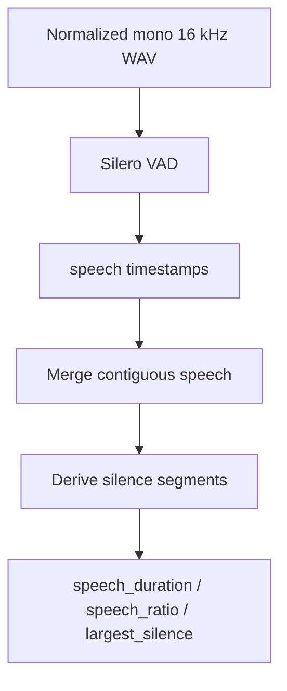

# VAD Pipeline

Purpose: Document Silero voice activity detection and segmentation outputs.

---

## Flow

---

## Configuration (`ANALYSIS_*`)

| Setting | Default | Role |
|---------|---------|------|
| `VAD_BACKEND` | `silero` | `silero` or `energy` (tests/fallback) |
| `VAD_THRESHOLD` | `0.5` | Silero speech probability threshold |
| `VAD_MIN_SPEECH_MS` | `250` | Drop short speech blips |
| `VAD_MIN_SILENCE_MS` | `100` | Merge nearby speech |
| `VAD_WINDOW_SAMPLES` | `512` | Silero window |
| `TIMEOUT_SECONDS` | `120` | Whole analysis timeout |

---

## Outputs (`vad` object)

- `speech_segments` / `silence_segments` — `{start, end}` seconds
- `speech_duration`, `speech_ratio`
- `largest_silence`
- `speech_start`, `speech_end`

---

## Failures

| Error | Exception | Worker |
|-------|-----------|--------|
| Model/inference failure | `VADException` | Mark asset FAILED |
| Timeout | `AnalysisTimeoutException` | Celery retry |
