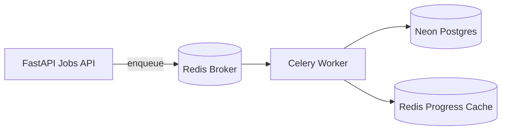

# Worker Architecture

Purpose: Describe how Celery workers orchestrate jobs without performing AI inference.

Responsibilities: `process_batch`, `process_audio`, `finalize_job`, heartbeat + Redis keys.

Dependencies: Neon PostgreSQL, Redis (broker + progress cache), `JobService`.

Extension points: Replace the 100ms sleep in `process_audio` with preprocess → infer → aggregate stages.

---

## Process model

Containers: `backend`, `worker`, `redis` (or Redis Cloud), Postgres (Neon). Never assume localhost.

---

## Tasks

| Task | Role |
|------|------|
| `process_batch(job_id)` | Recover stale PROCESSING assets, `start_job`, fan-out |
| `process_audio(audio_id, job_id)` | Independent per-file orchestration (simulated) |
| `finalize_job(results, job_id)` | Chord callback → `complete_job` / `fail_job` |
| `heartbeat` | Worker liveness + `worker:{hostname}` TTL key |

Fan-out uses Celery `group` + `chord` so each audio file is processed independently.

---

## Redis keys

| Key | Value | TTL |
|-----|-------|-----|
| `job:{id}:status` | Job status string | `JOB_PROGRESS_TTL_SECONDS` |
| `job:{id}:progress` | JSON progress payload | `JOB_PROGRESS_TTL_SECONDS` |
| `job:{id}:heartbeat` | Worker id last touching the job | `JOB_HEARTBEAT_TTL_SECONDS` |
| `worker:{hostname}` | Heartbeat JSON | `JOB_HEARTBEAT_TTL_SECONDS` |

Progress is always persisted in Postgres; Redis is a cache for `GET .../progress`.

---

## Worker recovery

On `process_batch`:

1. Assets stuck in `PROCESSING` are reset to `QUEUED`
2. Job is started (or resumed if already `RUNNING`)
3. Only non-terminal, non-FAILED assets are enqueued
4. Completed assets are skipped (idempotency)

---

## Logging events

Structured logs include `job_id`, `audio_id`, `worker_id`, `duration_ms` when applicable:

- `job_started` / `job_completed` / `job_failed`
- `audio_started` / `audio_completed`
- `retry_triggered`
- `worker_heartbeat` / `worker_recovery`

---

## What this sprint does **not** do

- FFmpeg / normalization / metadata
- Emotion / noise / predictions
- Auth / dashboard
